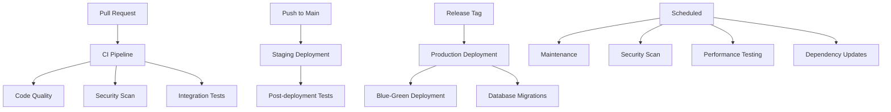

# GitHub Actions CI/CD Workflows

This directory contains the GitHub Actions workflows for the AI Creative Agent platform. The workflows are designed to ensure code quality, security, and reliable deployments.

## Workflow Overview

### 1. **CI - Pull Request** (`ci-pull-request.yml`)
**Trigger**: Pull requests to main/develop branches
**Purpose**: Comprehensive testing and validation for pull requests

**Jobs**:
- **Code Quality**: Python/Node.js linting, formatting, security scanning
- **Backend Tests**: Django test suite with PostgreSQL and Redis
- **Frontend Tests**: Next.js build verification and TypeScript compilation
- **Integration Tests**: Docker Compose testing with service health checks
- **Security Scan**: Trivy vulnerability scanning and CodeQL analysis
- **Build Verification**: Production Docker image building

### 2. **Deploy to Staging** (`deploy-staging.yml`)
**Trigger**: Push to main branch
**Purpose**: Automated deployment to staging environment

**Jobs**:
- **Pre-deployment Validation**: Full test suite and security scanning
- **Build and Push**: Docker image building and registry push
- **Deploy to Staging**: Staging environment deployment
- **Post-deployment Tests**: Smoke tests and performance validation
- **Notification**: Slack/email notifications

### 3. **Deploy to Production** (`deploy-production.yml`)
**Trigger**: Release tags (v*.*.*)
**Purpose**: Production deployment with blue-green strategy

**Jobs**:
- **Pre-deployment Validation**: Security and performance validation
- **Build Production Images**: Multi-platform Docker image building
- **Blue-Green Deployment**: Zero-downtime production deployment
- **Database Migrations**: Automated database schema updates
- **Post-deployment Validation**: Comprehensive health checks
- **Rollback Capability**: Automated rollback on failure

### 4. **Security Scan** (`security-scan.yml`)
**Trigger**: Scheduled (nightly), push to main, pull requests
**Purpose**: Comprehensive security scanning and compliance

**Jobs**:
- **Dependency Scan**: Python/Node.js vulnerability scanning
- **Container Scan**: Docker image security analysis
- **Code Security**: SAST scanning with Bandit and Semgrep
- **Secrets Detection**: TruffleHog and GitLeaks scanning
- **License Compliance**: Dependency license checking
- **OWASP Check**: OWASP dependency vulnerability scanning

### 5. **Maintenance** (`maintenance.yml`)
**Trigger**: Scheduled (weekly), manual dispatch
**Purpose**: System maintenance and monitoring

**Jobs**:
- **Dependency Updates**: Automated dependency update PRs
- **Database Maintenance**: Migration testing and optimization
- **Performance Testing**: Load and stress testing
- **System Cleanup**: Log cleanup and resource optimization
- **Monitoring Check**: Health endpoint monitoring
- **Security Updates**: Automated security patch application

### 6. **Code Quality** (`code-quality.yml`)
**Trigger**: Push to main/develop, pull requests
**Purpose**: Comprehensive code quality analysis

**Jobs**:
- **Python Quality**: Linting, formatting, type checking, security
- **Node.js Quality**: ESLint, Prettier, TypeScript compilation
- **Code Coverage**: Test coverage analysis and reporting
- **Complexity Analysis**: Code complexity and maintainability
- **Documentation Quality**: Documentation completeness checks

### 7. **Performance Testing** (`performance-testing.yml`)
**Trigger**: Push to main, pull requests, scheduled (weekly)
**Purpose**: Performance and load testing

**Jobs**:
- **Load Testing**: Normal load testing with Locust
- **Stress Testing**: High-load stress testing
- **Endurance Testing**: Extended period testing
- **Spike Testing**: Sudden load spike testing
- **Performance Monitoring**: Production endpoint monitoring

### 8. **Dependency Updates** (`dependency-updates.yml`)
**Trigger**: Scheduled (daily), manual dispatch
**Purpose**: Automated dependency management

**Jobs**:
- **Check Updates**: Scan for available updates
- **Security Updates**: Apply security patches automatically
- **Minor Updates**: Update to latest minor versions
- **Major Updates**: Update to latest major versions

## Environment Variables

### Required Secrets
```yaml
# Database
POSTGRES_PASSWORD
REDIS_PASSWORD

# External APIs
SERPAPI_API_KEY
DIFY_API_KEY
STRIPE_SECRET_KEY

# Deployment
DOCKER_REGISTRY_TOKEN
SLACK_WEBHOOK_URL

# Production
PROD_DB_HOST
PROD_DB_PORT
PROD_DB_NAME
PROD_DB_USER
PROD_DB_PASSWORD
```

### Environment Configuration
- **Development**: Local development with hot reloading
- **Staging**: Pre-production validation environment
- **Production**: Live production environment with monitoring

## Workflow Dependencies



## Best Practices

### 1. **Security**
- All workflows include security scanning
- Secrets are properly managed
- Container images are scanned for vulnerabilities
- Dependencies are regularly updated

### 2. **Quality**
- Comprehensive test coverage
- Code quality checks on every PR
- Performance testing before deployment
- Documentation quality validation

### 3. **Reliability**
- Blue-green deployment strategy
- Automated rollback capability
- Health checks and monitoring
- Database migration validation

### 4. **Maintenance**
- Automated dependency updates
- Regular security scanning
- Performance monitoring
- System cleanup and optimization

## Monitoring and Notifications

### Slack Integration
- Deployment status notifications
- Security scan results
- Performance test results
- Maintenance completion status

### Artifacts
- Test coverage reports
- Security scan results
- Performance test reports
- Dependency update reports

## Troubleshooting

### Common Issues
1. **Test Failures**: Check database connectivity and test data
2. **Security Scan Failures**: Review vulnerability reports
3. **Deployment Failures**: Check environment variables and permissions
4. **Performance Issues**: Review load test results and monitoring data

### Debugging
- Check workflow logs in GitHub Actions
- Review artifact uploads for detailed reports
- Monitor Slack notifications for real-time status
- Use manual workflow dispatch for testing

## Contributing

When adding new workflows:
1. Follow the existing naming conventions
2. Include comprehensive error handling
3. Add appropriate notifications
4. Update this README with new workflow information
5. Test workflows in development environment first

## Support

For issues with workflows:
1. Check the GitHub Actions logs
2. Review the workflow configuration
3. Verify environment variables and secrets
4. Contact the development team for assistance
